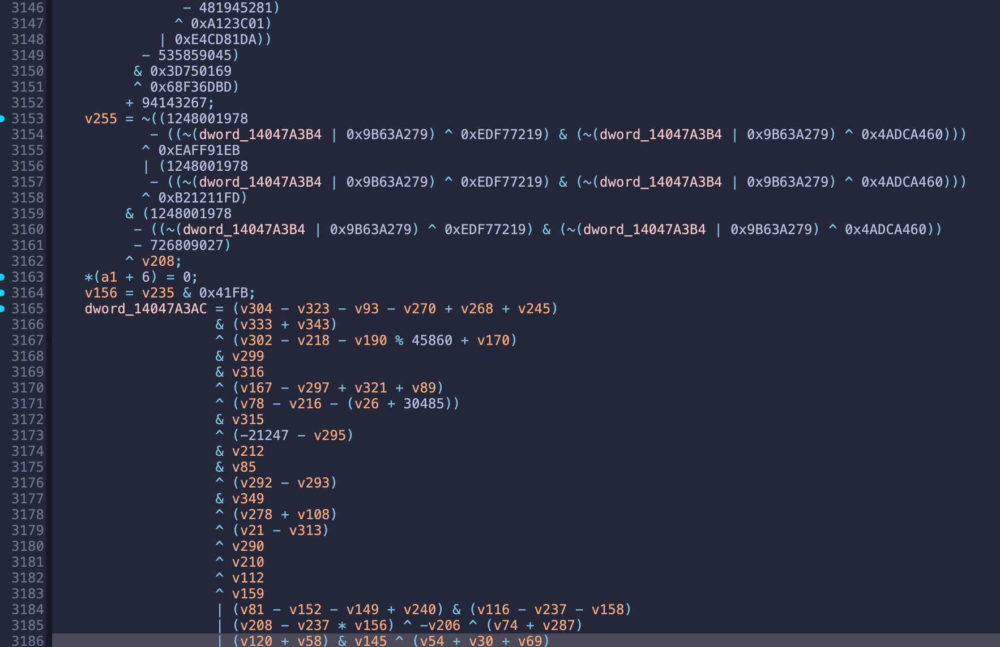
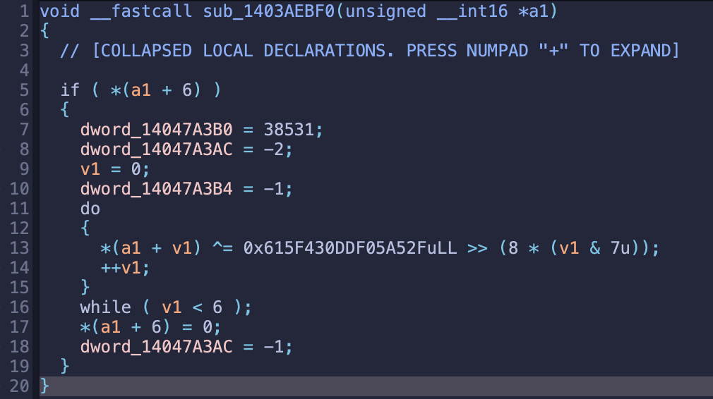

# ConstLoader

ConstLoader is a plugin helper that folds constant memory reads so your pseudocode becomes readable faster. It targets obfuscation patterns where values are fetched from tables or globals and then combined into opaque expressions.

## Requirements
- IDA Pro (I tested on version 9.3)

## Install
1. Copy `ConstLoader.py` into your IDA plugins folder:
   - macOS: `~/.idapro/plugins/`
   - Windows: `%APPDATA%\Hex-Rays\IDA Pro\plugins\`
2. Restart IDA

## Usage
Open: `Edit → Plugins → Const Loader`

Available actions:
- **Enable / Disable** — turn the optimizer on or off
- **Enable Debug** — show folding logs in the output window
- **Skip ReadOnly Check** — allow folding even if data is writable
- **Maturity** — choose the target microcode stage (MMAT_GENERATED, PREOPT, LOCOPT, CALLS, GLBOPT1)

You can also right‑click in Disasm or Pseudocode to access the same actions.

## Notes
- If a location is written **before** the read in the same function, the fold uses that written value.
- If a write happens **after** the read, the fold uses the current IDB value.
- When accuracy matters, keep **Skip ReadOnly Check** disabled.

## Example (Flare‑On 12 — Challenge 7)

### Before

### After

