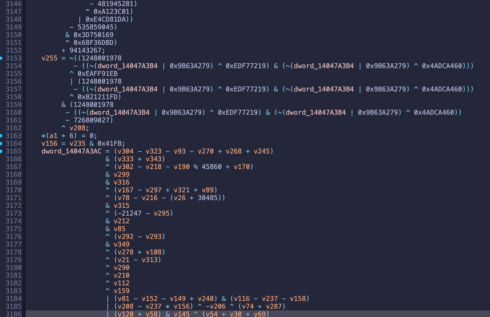
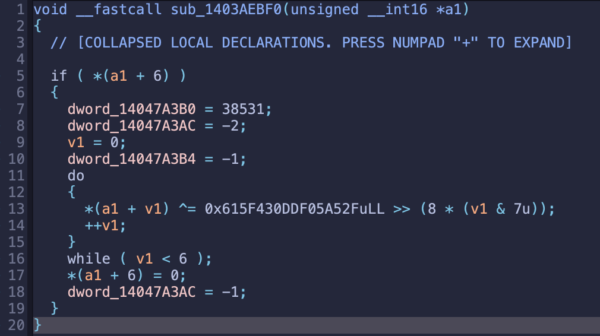

# ConstLoader

ConstLoader is an IDAPython plugin that folds constant-address memory reads in Hex-Rays microcode. It helps expose expressions hidden behind values loaded from tables or global data, a pattern often used by obfuscated binaries.

The optimizer changes decompiler microcode; it does not patch the input binary or IDB bytes.

## Requirements

- IDA Pro 9.3 with the Hex-Rays decompiler (the version tested by the author)
- No third-party Python packages

## Install

### IDA Plugin Manager

After the plugin is indexed in the community repository, install it with:

```sh
hcli plugin install const-loader
```

### Manual

Copy `ConstLoader.py` and `ida-plugin.json` into a `const-loader` folder under IDA's plugins directory, then restart IDA.

- macOS/Linux: `$IDAUSR/plugins/const-loader/` (commonly `~/.idapro/plugins/const-loader/`)
- Windows: `%APPDATA%\Hex-Rays\IDA Pro\plugins\const-loader\`

## Use

1. Open a database and wait for auto-analysis to finish.
2. Choose **Edit → Plugins → Const Loader → Enable**. Choose **Disable** to remove the optimizer.
3. Decompile or refresh a function to see the selected microcode maturity stage take effect.

The same controls are available from the right-click menus in disassembly and pseudocode views.

### Options

- **Enable Debug / Disable Debug** toggles fold messages in IDA's Output window.
- **Skip ReadOnly Check** bypasses the plugin's write-xref guard. Leave this off unless you know the target data is stable; enabling it can fold a value that changes at runtime.
- **Maturity** selects when the optimizer runs. The default is `MMAT_GENERATED`; other choices are `MMAT_PREOPTIMIZED`, `MMAT_LOCOPT`, `MMAT_CALLS`, and `MMAT_GLBOPT1`.

## Behavior and limitations

ConstLoader resolves supported constant addresses, reads the corresponding value from the IDB, and replaces eligible microcode memory reads with constants. For data with known write xrefs, it uses a limited scan of stores in the current function. It is not a general path-sensitive memory analysis: values that depend on complex control flow, indirect writes, or runtime state may be skipped or may not be represented by the current IDB contents.

The default guard uses IDA's available xrefs; it does not prove that a location is immutable. Review results when analyzing writable or self-modifying data.

## Example

The screenshots below show a sample function before and after ConstLoader is enabled.

### Before



### After



## Credits

Created by [tien026](https://github.com/tien0246) (doantien541@gmail.com).

## License

[MIT](./LICENSE)
